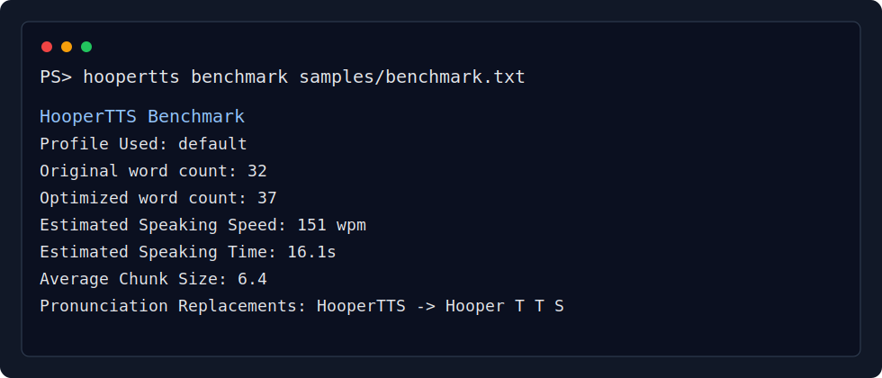
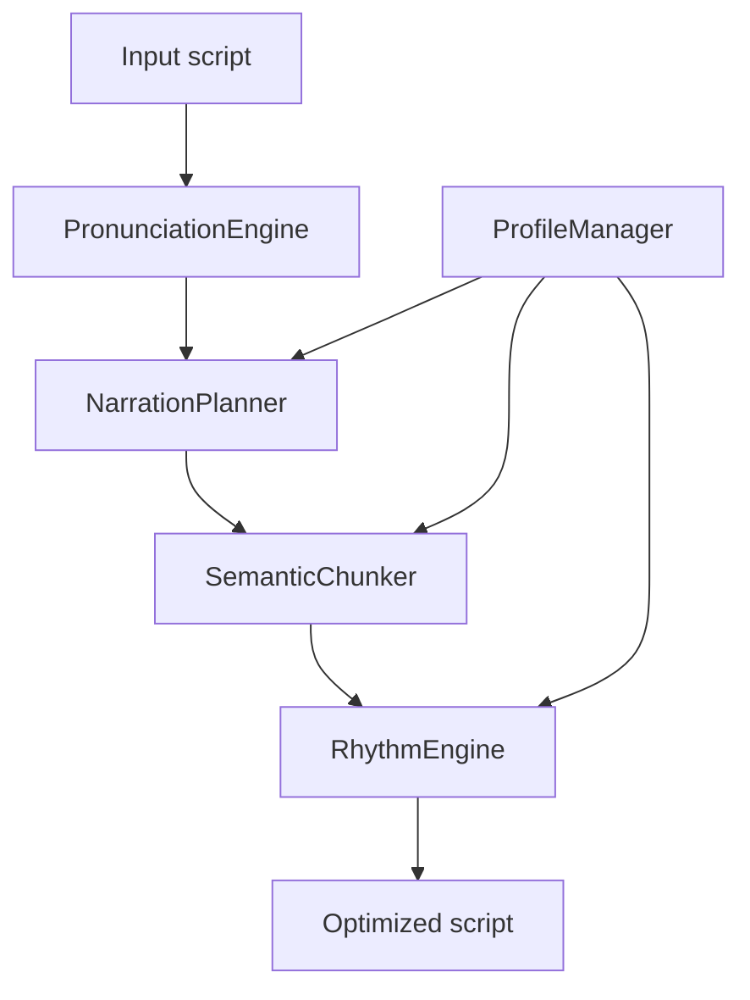

# HooperTTS

HooperTTS turns plain scripts into narration-friendly text for TTS workflows.
It focuses on pronunciation, sentence intent, semantic chunking, rhythm, and
profile-based delivery style while staying dependency-free.



## Installation

Install HooperTTS from a package index after release:

```bash
pip install hoopertts
```

Install HooperTTS locally from a source checkout:

```bash
pip install -e .
```

This exposes the `hoopertts` command.

## CLI Usage

```bash
hoopertts optimize script.txt
hoopertts benchmark script.txt
hoopertts compare script.txt
hoopertts profiles
hoopertts validate samples/
hoopertts doctor
```

Use `--profile` before the subcommand to select a narration profile:

```bash
hoopertts --profile gaming_news optimize script.txt
```

`optimize` prints optimized narration text, `benchmark` writes
`output/original.txt` and `output/optimized.txt`, `compare` prints both
versions, `profiles` lists bundled profiles, and `validate` checks every
`.txt` file in a directory.
`doctor` checks optional native Qwen3-TTS generation dependencies.

### CLI Examples

Optimize a script:

```bash
hoopertts optimize samples/benchmark.txt
```

Compare the original and optimized versions:

```bash
hoopertts compare samples/benchmark.txt
```

Run the benchmark with a profile:

```bash
hoopertts --profile youtube_shorts benchmark samples/benchmark.txt
```

List profiles:

```bash
hoopertts profiles
```

Validate sample scripts:

```bash
hoopertts validate samples/
```

## Native Generation

HooperTTS can optionally hand optimized narration to a local Qwen3-TTS backend.
The optimizer pipeline remains independent; generation lives under `qwen/`.

Check your environment:

```bash
hoopertts doctor
```

Generate audio:

```bash
hoopertts generate \
  --script gta.txt \
  --reference voice.wav \
  --profile gaming_news \
  --output output.wav
```

If CUDA, `torch`, `qwen_tts`, `soundfile`, or local model files are missing,
the command prints diagnostics instead of crashing.

### Environment setup

Native generation expects a CUDA-capable PyTorch environment and the Qwen3-TTS
Python package. The documented Colab workflow installs Qwen from the official
repository:

```bash
git clone https://github.com/QwenLM/Qwen3-TTS.git
cd Qwen3-TTS
pip install -e .
```

Install audio/runtime helpers in the environment that runs HooperTTS:

```bash
pip install soundfile pydub huggingface_hub
```

### Model download

Download or cache the desired Hugging Face model before generation. The Qwen
runner looks for local model files in the Hugging Face cache or
`./qwen_tts_model/`, following the model ids documented in
[docs/QWEN_INTEGRATION.md](docs/QWEN_INTEGRATION.md).

## Evaluation

Evaluate a larger dataset recursively:

```bash
python evaluate.py datasets/scripts --output evaluation --profile default
```

The evaluator optimizes every `.txt` script and writes:

- `results.csv`
- `summary.json`
- `summary.md`

Reports include word counts, profile, pauses, chunks, narration score,
estimated speaking time, pronunciation replacements, hooks, reveals, questions,
CTAs, average statistics, profile distribution, optimization totals, and
warnings.

## Benchmark

Run the optimizer benchmark from the project root:

```bash
python benchmark.py
```

The benchmark reads the first `.txt` file in `samples/`, writes
`output/original.txt` and `output/optimized.txt`, and prints a comparison
summary with word counts, inserted pauses, emphasized words, estimated
narration groups, estimated breath groups, average words per group, and the
longest and shortest groups. It also lists pronunciation replacements found in
the sample, planner counts for hooks, reveals, questions, and CTAs, and chunk
statistics. The benchmark also reports the active narration profile, estimated
speaking speed, and estimated speaking time.

Example:

```text
HooperTTS Benchmark
===================
Source file: samples/benchmark.txt
Profile Used: default
Original word count: 32
Optimized word count: 37
Estimated Speaking Speed: 151 wpm
Estimated Speaking Time: 16.1s
Average Chunk Size: 6.4
Pronunciation Replacements:
HooperTTS -> Hooper T T S
NPC -> N P C
```

## Before And After

Before:

```text
Imagine opening HooperTTS for the first time. The NPC reacts to every detail, but the delivery needs rhythm.
```

After:

```text
...
Imagine opening Hooper T T S for
the first time.

...
The N P C reacts to
every detail,
...
but the delivery needs rhythm.
```

## Architecture



See [docs/Architecture.md](docs/Architecture.md) for more detail.

## Narration Profiles

HooperTTS loads narration profiles from `profiles/` through
`core.profile.ProfileManager`. `ScriptOptimizer.optimize(...)` still works with
the original arguments, and also accepts `profile="default"` or another profile
name such as `gaming_news`, `youtube_shorts`, `documentary`, or `podcast`.
Profiles configure pause strength, hook/reveal/question/ending style, chunk
target, and sentence energy curve.

See [docs/Profiles.md](docs/Profiles.md) for profile structure and examples.

## Narration Planner

HooperTTS uses `core.planner.NarrationPlanner` to analyze each sentence before
rhythm rendering. `plan(text)` returns `SentencePlan` objects with sentence
type, estimated energy, pause estimates, emphasized words, and semantic chunks.
Supported types are `HOOK`, `REVEAL`, `QUESTION`, `CTA`, `EVIDENCE`,
`CONTRAST`, and `NORMAL`.

## Semantic Chunker

HooperTTS uses `core.chunker.SemanticChunker` to split each sentence into
natural spoken idea groups. Chunks protect names such as `Grand Theft Auto 6`,
prefer boundaries after commas and speech connectors, and stay between two and
seven words except for intentional dramatic one-word chunks.

## Rhythm Engine

HooperTTS uses `core.rhythm.RhythmEngine` to shape scripts into natural spoken
thought groups. The engine protects known names such as `Grand Theft Auto 6`,
`Rockstar Games`, and `Lucia and Jason`, adds pauses around openings and
contrast words, emphasizes reveal words, and gives the final sentence a cleaner
narration cadence without adding a trailing ellipsis.

## Pronunciation Engine

HooperTTS uses `core.pronunciation.PronunciationEngine` before rhythm
optimization. It loads `pronunciation.json` from the project root and replaces
configured written terms with spoken forms, such as `HooperTTS` to
`Hooper T T S` and `NPC` to `N P C`, while preserving surrounding punctuation.

## Tests

Run the dependency-free test files directly:

```bash
python tests/test_optimizer.py
python tests/test_chunker.py
python tests/test_profile.py
python tests/test_cli.py
python tests/test_evaluate.py
python tests/test_qwen.py
```

CI runs the same dependency-free tests plus `py_compile` on Python 3.10, 3.11,
and 3.12.

## Documentation

- [Architecture](docs/Architecture.md)
- [Profiles](docs/Profiles.md)
- [Roadmap](docs/Roadmap.md)
- [Contributing](CONTRIBUTING.md)
