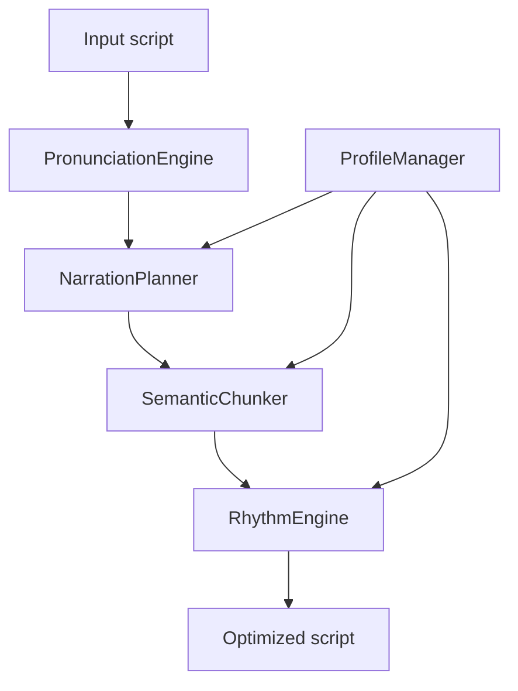

# Architecture

HooperTTS is a small, dependency-free narration optimization pipeline.



## Pipeline

1. `PronunciationEngine` replaces configured written terms with spoken forms.
2. `NarrationPlanner` splits text into sentences and assigns metadata such as
   sentence type, energy, pauses, emphasized words, and chunks.
3. `SemanticChunker` creates spoken idea groups while protecting known phrases.
4. `RhythmEngine` renders chunks with profile-aware pauses, reveal emphasis,
   and ending cadence.
5. `ScriptOptimizer` coordinates the pipeline without exposing internal stages
   to callers.

## Evaluation

`evaluate.py` reuses benchmark metrics and core pipeline components to process
large datasets recursively. It writes per-script metrics to `results.csv` and
aggregate summaries to `summary.json` and `summary.md`.

## Public API

The stable API is:

```python
from core.optimizer import ScriptOptimizer

optimized = ScriptOptimizer().optimize(text, style="documentary")
```

Profiles can be selected without breaking existing calls:

```python
optimized = ScriptOptimizer().optimize(text, profile="gaming_news")
```
