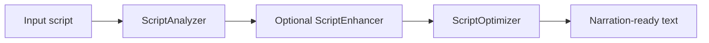
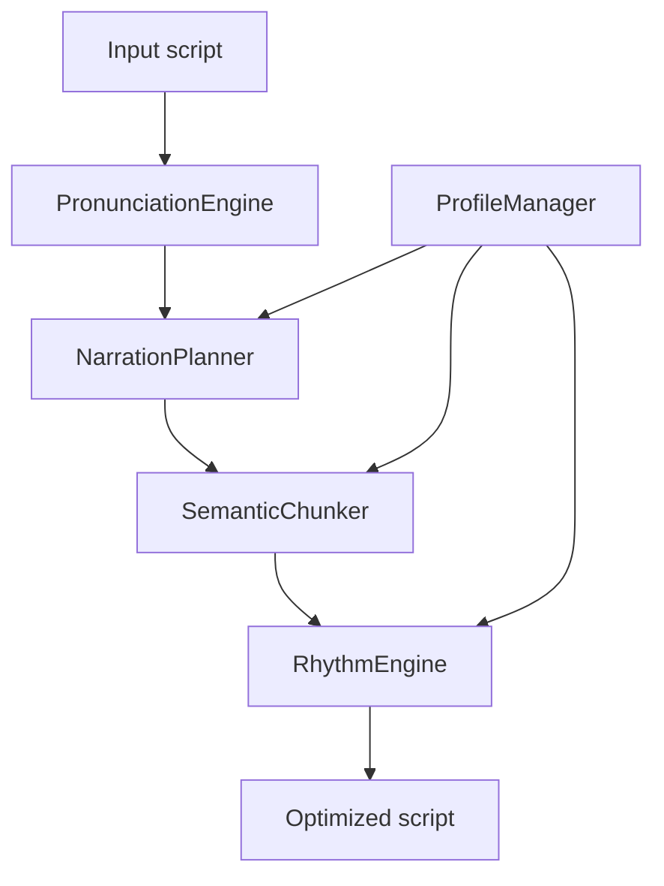

# Architecture

HooperTTS is a small, dependency-free narration optimization pipeline.

## Script Intelligence v0.3-alpha

The optional Script Intelligence foundation sits before narration optimization.
It provides deterministic analysis, profile-aware enhancement policies, and
protected-span validation without changing the existing optimizer or requiring
an LLM backend. Its default enhancement backend is unavailable and preserves
the source text with a diagnostic.

v0.3-beta adds an opt-in `HuggingFaceEnhancementBackend` for Qwen3 text
generation. It is never loaded by default or in Optimize Only mode. It loads
only while enhancement is explicitly requested, releases its model and CUDA
cache immediately after generation, and still passes every candidate through
the protected-span validator.

To install the optional backend in a GPU Google Colab runtime:

```bash
pip install -e ".[enhancement]"
python enhancement_benchmark.py samples/benchmark.txt --profile friendslop_gaming
```

Google Colab GPU runtimes already include PyTorch; the optional extra installs
only Transformers and Accelerate.

Set `HOOPERTTS_ENHANCEMENT_MODEL_ID=Qwen/Qwen3-0.6B` before running to use the
smaller model. The experiment reads its input but never writes to it.

Generation samples by default (`do_sample=True`, `temperature=0.8`, `top_p=0.9`)
rather than using greedy decoding, since greedy decoding always picks the single
highest-probability token and tends to stay close to a near-paraphrase of the
input even when the writing goals ask for a bolder rewrite. Override with
`HOOPERTTS_ENHANCEMENT_DO_SAMPLE=false` (back to deterministic greedy decoding),
`HOOPERTTS_ENHANCEMENT_TEMPERATURE=<float>`, or `HOOPERTTS_ENHANCEMENT_TOP_P=<float>`.
Protected-span validation is unaffected by decoding strategy and remains the hard
safety net against invented or dropped facts either way.

`qwen.runner.generate()` (used by both `app.py` and `hoopertts generate`) now
wires this pipeline into the real generation path via `enhancement_mode`
(`optimize_only` default / `enhance_only` / `enhance_and_optimize`) and
`enhancement_model_tier` (`quality` → Qwen3-1.7B default, `fast` →
Qwen3-0.6B). The Gradio app exposes both as dropdowns, off by default, so a
Colab free-tier user only pays the extra model-load cost if they opt in.


```mermaid
flowchart LR
    A["Input script"] --> B["ScriptAnalyzer"]
    B --> C["Optional ScriptEnhancer"]
    C --> D["ScriptOptimizer"]
    D --> E["Narration-ready text"]
```


```mermaid
flowchart TD
    A["Input script"] --> B["PronunciationEngine"]
    B --> C["NarrationPlanner"]
    C --> D["SemanticChunker"]
    D --> E["RhythmEngine"]
    E --> F["Optimized script"]
    G["ProfileManager"] --> C
    G --> D
    G --> E
```

## Pipeline

1. `PronunciationEngine` replaces configured written terms with spoken forms.
2. `NarrationPlanner` splits text into sentences and assigns metadata such as
   sentence type, energy, pauses, emphasized words, and chunks.
3. `SemanticChunker` creates spoken idea groups while protecting known phrases.
4. `RhythmEngine` renders chunks with profile-aware pauses, reveal emphasis,
   and ending cadence.
5. `ScriptOptimizer` coordinates the pipeline without exposing internal stages
   to callers.

## Evaluation

`evaluate.py` reuses benchmark metrics and core pipeline components to process
large datasets recursively. It writes per-script metrics to `results.csv` and
aggregate summaries to `summary.json` and `summary.md`.

## Public API

The stable API is:

```python
from core.optimizer import ScriptOptimizer

optimized = ScriptOptimizer().optimize(text, style="documentary")
```

Profiles can be selected without breaking existing calls:

```python
optimized = ScriptOptimizer().optimize(text, profile="gaming_news")
```
