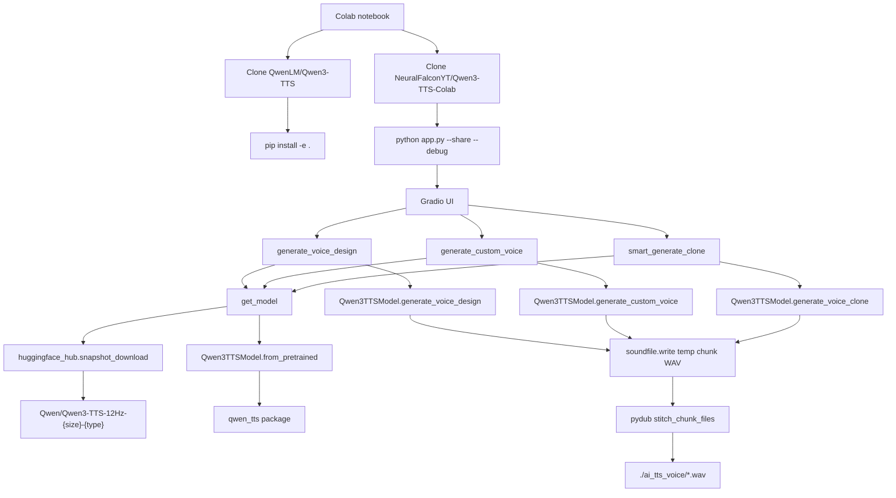

# Qwen3-TTS Colab Integration Notes

This document traces the inference workflow used by
`NeuralFalconYT/Qwen3-TTS-Colab` so HooperTTS can later embed the same workflow.
It is documentation only; no HooperTTS runtime code has been changed for Qwen.

Source inspected:

- `Qwen3-TTS-Colab/Qwen3_TTS_Colab.ipynb`
- `Qwen3-TTS-Colab/app.py`
- `Qwen3-TTS-Colab/process_text.py`
- `Qwen3-TTS-Colab/hf_downloader.py`
- `Qwen3-TTS-Colab/requirements.txt`

## High-Level Dependency Graph



## Execution Flow

1. The notebook changes to `/content/`.
2. It clones `https://github.com/NeuralFalconYT/Qwen3-TTS-Colab.git`.
3. It clones `https://github.com/QwenLM/Qwen3-TTS.git`.
4. It enters `/content/Qwen3-TTS` and runs `pip install -e .`.
5. It installs the Colab helper dependencies:
   - `faster-whisper==1.1.1`
   - `ctranslate2==4.5.0`
   - `pysrt`
   - `sentencex`
6. It changes to `/content/Qwen3-TTS-Colab`.
7. It launches `python app.py --share --debug`.
8. `app.py` builds a Gradio UI with three inference modes:
   - Voice Design
   - Voice Clone
   - TTS with CustomVoice speakers
9. User input flows into one of:
   - `generate_voice_design(...)`
   - `generate_custom_voice(...)`
   - `smart_generate_clone(...)`
10. Each generator chunks long text through `process_text.text_chunk(...)`.
11. The selected model is loaded through `get_model(...)`.
12. The selected Qwen inference method returns `wavs, sr`.
13. Each chunk is immediately written to a temporary WAV file.
14. Temporary chunks are stitched with `pydub.AudioSegment`.
15. Optional silence removal and subtitle generation run after stitching.
16. Gradio receives the final WAV filepath.

## Where The Model Is Downloaded

Model download starts in `app.py`:

```python
def get_model_path(model_type: str, model_size: str) -> str:
    try:
      return snapshot_download(f"Qwen/Qwen3-TTS-12Hz-{model_size}-{model_type}")
    except Exception as e:
      return download_model(
          f"Qwen/Qwen3-TTS-12Hz-{model_size}-{model_type}",
          download_folder="./qwen_tts_model",
          redownload=False,
      )
```

Primary path:

- `huggingface_hub.snapshot_download(...)`
- Hugging Face repo id format:
  - `Qwen/Qwen3-TTS-12Hz-0.6B-Base`
  - `Qwen/Qwen3-TTS-12Hz-1.7B-Base`
  - `Qwen/Qwen3-TTS-12Hz-0.6B-CustomVoice`
  - `Qwen/Qwen3-TTS-12Hz-1.7B-CustomVoice`
  - `Qwen/Qwen3-TTS-12Hz-1.7B-VoiceDesign`

Fallback path:

- `hf_downloader.download_model(...)`
- Downloads every Hugging Face sibling file into:
  - `./qwen_tts_model/{repo_name}/`

In normal Hugging Face operation, `snapshot_download` uses the Hugging Face hub
cache, typically under the user's `.cache/huggingface/hub` directory. The
README also points users there when deleting downloaded models.

## How The Model Is Loaded

`app.py` keeps loaded models in a global cache:

```python
loaded_models = {}
```

Model loading is handled by `get_model(model_type, model_size)`:

```python
model_path = get_model_path(model_type, model_size)
model = Qwen3TTSModel.from_pretrained(
    model_path,
    device_map="cuda",
    dtype=torch.bfloat16,
)
loaded_models[key] = model
```

Important details:

- The class is imported as `from qwen_tts import Qwen3TTSModel`.
- The runtime assumes CUDA via `device_map="cuda"`.
- It uses `torch.bfloat16`.
- Before loading a different model key, `clear_other_models(...)` deletes older
  model instances and clears CUDA memory.

## Which Python Package Performs Inference

Inference is performed by the `qwen_tts` Python package, specifically:

```python
from qwen_tts import Qwen3TTSModel
```

The notebook obtains that package by cloning `QwenLM/Qwen3-TTS` and running
`pip install -e .` from the official Qwen repository. The Colab repo also lists
`qwen-tts` in `requirements.txt`, but the notebook path explicitly installs the
cloned official source.

## Functions That Generate Audio

There are three app-level generation wrappers:

### Voice Design

```python
wavs, sr = tts.generate_voice_design(
    text=chunk.strip(),
    language=language,
    instruct=voice_description.strip(),
    non_streaming_mode=True,
    max_new_tokens=2048,
)
```

App wrapper:

- `generate_voice_design(text, language, voice_description, remove_silence, make_subs)`

Model type:

- `VoiceDesign`

Model size:

- Always `1.7B`

### Custom Voice TTS

```python
wavs, sr = tts.generate_custom_voice(
    text=chunk.strip(),
    language=language,
    speaker=formatted_speaker,
    instruct=instruct.strip() if instruct else None,
    non_streaming_mode=True,
    max_new_tokens=2048,
)
```

App wrapper:

- `generate_custom_voice(text, language, speaker, instruct, model_size, remove_silence, make_subs)`

Model type:

- `CustomVoice`

Model size:

- User selected: `0.6B` or `1.7B`

### Voice Clone

```python
wavs, sr = tts.generate_voice_clone(
    text=chunk.strip(),
    language=language,
    ref_audio=audio_tuple,
    ref_text=final_ref_text.strip() if final_ref_text else None,
    x_vector_only_mode=use_xvector_only,
    max_new_tokens=2048,
)
```

App wrapper:

- `smart_generate_clone(ref_audio, ref_text, target_text, language, mode, model_size, remove_silence, make_subs)`

Model type:

- `Base`

Model size:

- User selected: `0.6B` or `1.7B`

## How Reference Audio Is Passed

The Gradio Voice Clone tab uses:

```python
clone_ref_audio = gr.Audio(
    label="Reference Audio (Upload a voice sample to clone)",
    type="filepath",
)
```

That filepath is passed into:

```python
smart_generate_clone(ref_audio, ref_text, target_text, ...)
```

Then converted by `_audio_to_tuple(ref_audio)`:

```python
wav, sr = sf.read(audio_path)
wav = _normalize_audio(wav)
return wav, int(sr)
```

The model receives:

```python
ref_audio=audio_tuple
```

where `audio_tuple` is shaped as:

```python
(wav_float32_mono_numpy_array, sample_rate_int)
```

Reference transcript handling:

- High-quality mode uses audio plus transcript.
- Fast mode uses audio only and sets `x_vector_only_mode=True`.
- If high-quality mode has no reference text, the app tries to transcribe the
  reference audio with `subtitle_maker(...)`, which uses the faster-whisper
  stack in this repo.

## How Style Prompt Is Passed

There are two style-prompt paths:

### Voice Design

The "Voice Description" textbox is passed as:

```python
instruct=voice_description.strip()
```

into:

```python
tts.generate_voice_design(...)
```

Example default UI value:

```text
Speak in an incredulous tone, but with a hint of panic beginning to creep into your voice.
```

### CustomVoice TTS

The optional "Style Instruction" textbox is passed as:

```python
instruct=instruct.strip() if instruct else None
```

into:

```python
tts.generate_custom_voice(...)
```

Voice Clone does not pass a style prompt. It passes target text, language,
reference audio, optional reference transcript, and the x-vector mode flag.

## Where Output WAV Is Written

There is no fixed `output.wav` path in this repo.

Final output file naming is handled by `process_text.get_tts_file_name(...)`:

```python
temp_audio_dir = "./ai_tts_voice/"
os.makedirs(temp_audio_dir, exist_ok=True)
...
return os.path.join(
    temp_audio_dir,
    f"{clean}_{language}_{uid}.wav"
)
```

`text_chunk(...)` returns:

```python
chunks, tts_file_name
```

Each generator writes temporary chunk files in the current working directory:

- `temp_chunk_{i}_{pid}.wav` for Voice Design
- `temp_custom_{i}_{pid}.wav` for CustomVoice
- `temp_clone_{i}_{pid}.wav` for Voice Clone

Then `stitch_chunk_files(chunk_files, tts_filename)` writes the final file:

```python
combined_audio.export(output_filename, format="wav")
```

So the final file is usually:

```text
./ai_tts_voice/{clean_text_prefix}_{language_code}_{uuid}.wav
```

If silence removal is enabled, `remove_silence_function(...)` writes:

```text
./ai_tts_voice/{clean_text_prefix}_{language_code}_{uuid}_no_silence.wav
```

and returns that path to Gradio instead.

## Required Packages

Directly listed in `requirements.txt`:

- `qwen-tts`
- `pysrt`
- `sentencex`
- `faster-whisper==1.1.1`
- `ctranslate2==4.6.0`

Installed by the notebook:

- Official `QwenLM/Qwen3-TTS` via `pip install -e .`
- `faster-whisper==1.1.1`
- `ctranslate2==4.5.0`
- `pysrt`
- `sentencex`

Imported by `app.py` and therefore required by the running app:

- `qwen_tts`
- `torch`
- `numpy`
- `soundfile`
- `pydub`
- `gradio`
- `huggingface_hub`
- `click`
- `requests`
- `tqdm`

Transcription/subtitle helpers additionally use the faster-whisper and subtitle
dependencies imported from `subtitle.py`.

## Model Files

Model repositories are selected dynamically:

```text
Qwen/Qwen3-TTS-12Hz-{model_size}-{model_type}
```

Variables:

- `model_size`: `0.6B` or `1.7B`
- `model_type`: `Base`, `CustomVoice`, or `VoiceDesign`

Expected concrete repositories:

- `Qwen/Qwen3-TTS-12Hz-0.6B-Base`
- `Qwen/Qwen3-TTS-12Hz-1.7B-Base`
- `Qwen/Qwen3-TTS-12Hz-0.6B-CustomVoice`
- `Qwen/Qwen3-TTS-12Hz-1.7B-CustomVoice`
- `Qwen/Qwen3-TTS-12Hz-1.7B-VoiceDesign`

The exact internal file list comes from Hugging Face. The fallback downloader
queries:

```text
https://huggingface.co/api/models/{repo_id}
```

and downloads every `siblings[].rfilename` via:

```text
https://huggingface.co/{repo_id}/resolve/main/{file}
```

## Inference API Shape

A minimal integration wrapper would need to reproduce these calls:

```python
from qwen_tts import Qwen3TTSModel
import torch

model = Qwen3TTSModel.from_pretrained(
    model_path,
    device_map="cuda",
    dtype=torch.bfloat16,
)
```

Voice Design:

```python
wavs, sr = model.generate_voice_design(
    text=text,
    language=language,
    instruct=style_prompt,
    non_streaming_mode=True,
    max_new_tokens=2048,
)
```

CustomVoice:

```python
wavs, sr = model.generate_custom_voice(
    text=text,
    language=language,
    speaker=speaker_id,
    instruct=style_prompt_or_none,
    non_streaming_mode=True,
    max_new_tokens=2048,
)
```

Voice Clone:

```python
wavs, sr = model.generate_voice_clone(
    text=text,
    language=language,
    ref_audio=(wav_array, sample_rate),
    ref_text=reference_transcript_or_none,
    x_vector_only_mode=fast_mode,
    max_new_tokens=2048,
)
```

Returned values:

- `wavs`: list-like waveform output; app uses `wavs[0]`
- `sr`: sample rate

The Colab writes audio with:

```python
sf.write(path, wavs[0], sr)
```

## Potential HooperTTS Integration Points

HooperTTS should not embed the Gradio UI. The useful pieces are the inference
and file-handling boundaries:

1. Add an optional Qwen backend module outside the optimizer core.
2. Keep HooperTTS text optimization independent from Qwen model loading.
3. Pass HooperTTS optimized chunks into Qwen generation methods.
4. Map HooperTTS profiles to Qwen style prompts:
   - `VoiceDesign`: map profile/style text to `instruct`.
   - `CustomVoice`: map profile/style text to optional `instruct`.
   - `VoiceClone`: use profile only for text optimization unless a style
     strategy is added later.
5. Reuse HooperTTS chunking instead of `process_text.text_chunk(...)` where
   possible, but preserve a character limit guard for model safety.
6. Convert uploaded or local reference audio into `(wav, sr)` before calling
   `generate_voice_clone`.
7. Write temporary chunks into a HooperTTS-controlled temp directory.
8. Write final WAVs into a HooperTTS output directory with deterministic naming
   if CLI workflows need reproducibility.
9. Keep model download/cache configuration explicit:
   - model repo id
   - model size
   - model type
   - cache/output directory
10. Gate CUDA-specific loading options behind configuration so CPU or different
    GPU environments fail clearly.

## Important Differences From HooperTTS

- NeuralFalcon's app is UI-first and Gradio-oriented.
- HooperTTS is CLI/library-first.
- NeuralFalcon chunks by character count for model safety.
- HooperTTS chunks semantically for narration flow.
- NeuralFalcon writes final files under `./ai_tts_voice/`.
- HooperTTS currently writes benchmark/evaluation artifacts under controlled
  output directories.
- NeuralFalcon's notebook installs and runs the official Qwen source directly;
  HooperTTS should isolate that as an optional backend dependency.
